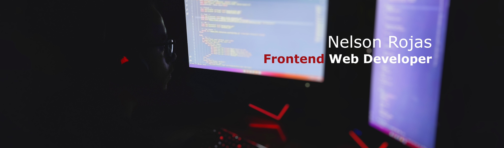

# About me

👋 Hi, my name is Nelson Rojas, I am a **Frontend Web Developer**. I consider myself an outgoing, fun, and friendly person.

## Hobbies

🎮 In my free time, I enjoy playing video games, especially those in the **Survival** or **RPG** genres.

## Beginnings

🖥️🖱️ I was introduced to the tech world when I received my first laptop in 5th grade at the age of 12. It was then that I realized I wanted to work in this sector. I remember learning how to download images from Google and feeling like a hacker.

👨‍💻 I knew I wanted to work with computers from a young age, but I wasn't sure which specialty to pursue. My first experience with programming came at the age of 15 when I started researching video game development and found a game engine called **Unity**. At that time, there were tutorials on YouTube about programming with C#, and I started learning. Everything was going well until I encountered loops. My mind couldn't grasp what was happening, so I got overwhelmed and stopped programming.

## Professional
📝 In May 2020, because I didn't want to be a waiter for the rest of my life, I decided to start programming again, but this time with clearer goals. I set a long-term goal for myself: to become a Video Game Developer. I conducted a job market study in Spain and concluded that web development was in high demand. So, I decided to study web development on Udemy. I started learning HTML, CSS, Python, and Django (a chaotic path to begin programming).

🧐 In May 2021, I established a primary learning path (with the obviously popular trinity) HTML, CSS, JavaScript (although I haven't started studying JavaScript yet, I had a solid foundation in Python). The difference this time was that I took my time to thoroughly learn the basics of each language (reading and doing projects). Through practice, I discovered that web development is an amazing field.

👨‍💼 After two years of dedicated study and numerous projects,In August 2022, I finally secured a position at **Playtech** as a **Website Manager**. This role has allowed me to apply my skills and knowledge in a professional setting, managing and enhancing various web projects while contributing to the company's digital presence.

[Portfolio](https://nrdevpy.github.io/Portfolio/)

# Social Networks

  

# Technologies

