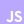

<h1 style="color:#baa8ff;">Nelson Rojas - Frontend Developer</h1>
    
  

<h2 style="color:#baa8ff;">About me</h2>

Hi there!! 👋

My name is Nelson Rojas, I am a <strong style="color: #baa8ff;">Frontend Developer</strong>. I consider myself an outgoing, fun, and friendly person.

<h3>Beginnings</h3>

I was introduced to the tech world when I received my first laptop in 5th grade at the age of 12. It was then that I realized I wanted to work in this sector (I remember learning how to download images from Google and feeling like a hacker).

I knew I wanted to work with computers from a young age, but I wasn't sure which specialty to pursue.

My first experience with programming came at the age of 15 when I started researching video game development and found a game engine called <strong style="color: #baa8ff;">Unity</strong>. At that time, there were tutorials on YouTube about programming with <strong style="color: #baa8ff;">C#</strong>, and I started learning. 

Everything was going well until I encountered loops. My mind couldn't grasp what was happening, so I got overwhelmed and stopped programming.

<h3>Professional</h3>
I decided to start programming again, but this time with 
<strong style="color: #baa8ff;">clearer goals</strong>. I set a long-term goal for myself: to become a Video Game Developer. 

I conducted a job market study in Spain and concluded that web development was in high demand. So, I decided to study web development on Udemy. I started learning HTML, CSS, Python, and Django, a chaotic path to begin programming (It wents very bad and I had to find an alternative learning path).

I established a primary learning path (with the obviously popular trinity) <strong style="color: #baa8ff;">HTML</strong>, <strong style="color: #baa8ff;">CSS</strong>, <strong style="color: #baa8ff;">JavaScript</strong> (although I haven't started studying JavaScript yet, I had a solid foundation in Python). 

The difference this time was that I took my time to thoroughly learn the basics of each language, <strong style="color: #baa8ff;">reading</strong> and developing <strong style="color: #baa8ff;">projects</strong>.

Through practice, I discovered that I love web development is an amazing field where I could be working on this for the rest of my life.

After two years of dedicated study and numerous projects, In August 2022, I finally secured a position at <strong style="color: #baa8ff;">Playtech</strong> as a <strong style="color: #baa8ff;">Website Manager</strong>.

This role has allowed me to apply my <strong style="color: #baa8ff;">skills</strong> and <strong style="color: #baa8ff;">knowledge</strong> in a professional setting, managing and enhancing various side software projects while contributing to the company's digital presence.

<h3>Hobbies</h3>

In my free time, I enjoy playing video games, especially those in the <strong style="color: #baa8ff;">Survival</strong> or <strong style="color: #baa8ff;">RPG</strong> genres and spending time with friend and family.

<h3>Social Networks</h3>

   

<h2 style="color:#baa8ff;">Technologies</h2>
<h3>Languages</h3>

  

<h3>JS Frameworks / Libraries</h3>

  

<h3>CSS Frameworks / Libraries</h3>

  

<h3>Others</h3>

   
<h2>Portfolio Frontend Developer</h2>
If you would like to see my portfolio and know more about me, click on the image above or below to see my portfolio.
  
